# Deploying a Flask App on AWS

## Overview

In this guide, you’ll work through the process of

1. purchasing a domain name,
2. configuring that domain name to point to a server,
3. setting up a server, and
4. configuring HTTPS.

This process will take some time, make sure to budget at least 1 hour.

## Background Terms

- _Domain Registrar_ - A domain registrar is a company that has been granted permission by ICANN (the Internet Standards body) to lease domain names to an end user for a yearly fee. You can get 1 `.me` domain name for free through the Github Education Student Developer Pack. If you prefer `.com` or `.org`, this will require a yearly fee of around $15 for each year you wish the domain to be active.
- _Domain Name Service (DNS)_ - DNS is the phonebook of the internet. It allows you to tell a browser when a person visits google.com, where the server that runs google.com lives.
- _Elastic Compute 2 (EC2)_ - EC2 is Amazon Web Service’s (AWS) virtual server hosting service.
- _SystemD_ - SystemD is a modern service standard for servers that allows application servers to run as background servers so they automatically start when the server boots, and they can easily be restarted.
- _Target Group_ - AWS Target Groups are the intermediary between load balancers (which receive internet traffic) and EC2 instances which run the web application.
- _Elastic Load Balancer (ELB)_ - ELBs are AWS’s primary internet traffic receipt mechanism. They can receive traffic from external sources (users) and forward that traffic to any internal source.

## Accounts

This guide will make use of [Namecheap](https://namecheap.com) as the Domain Registrar and [Cloudflare](https://cloudflare.com) as the DNS provider. You are welcome to use others as desired.

## Setup

We’ll start at the bottom with the server, then work our way up to the domain.

### Server Setup

1. Sign up for an account on AWS using their [Free Tier](https://aws.amazon.com/free).

> Warning: The free tier lasts for one year (12 calendar months) after which payment is required for the services used.

2. Once you have logged into the Console, use the search bar at the top to search for EC2, then click the service.
3. Under Resources, you'll see a yellow button labeled `Launch Instance`. Go ahead and click it.
   1. Under Names and Tags, give your server a good name like `Web Server`.
      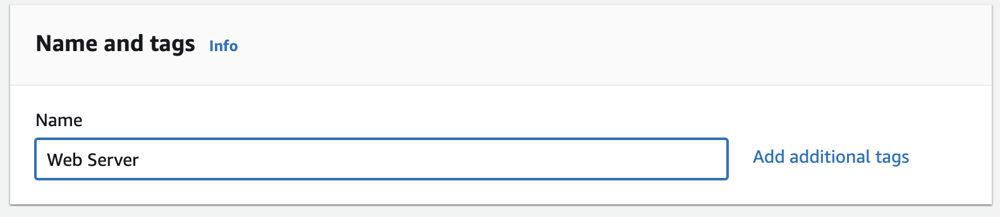
   2. Under Application and OS Images, change the image type to `Ubuntu` then pick the most recent LTS from the AMI dropdown.
      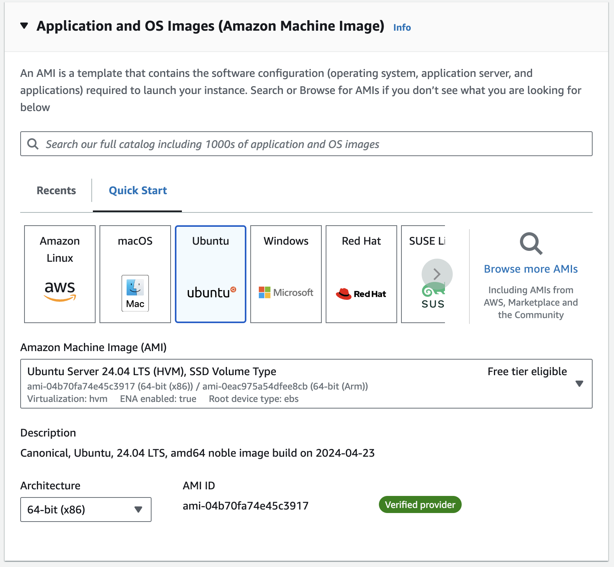
   3. Under Instance Type, leave `t2.micro` selected.
      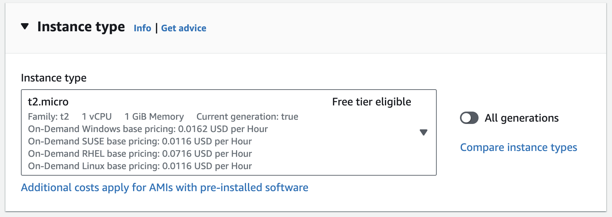
   4. Under Key Pair, click `Create new key pair`. Enter a name like `Web Server`, but leave all other settings as their default. Ensure the downloaded file when you click create is stored somewhere safe. If you lose this, you lose access to your server.
      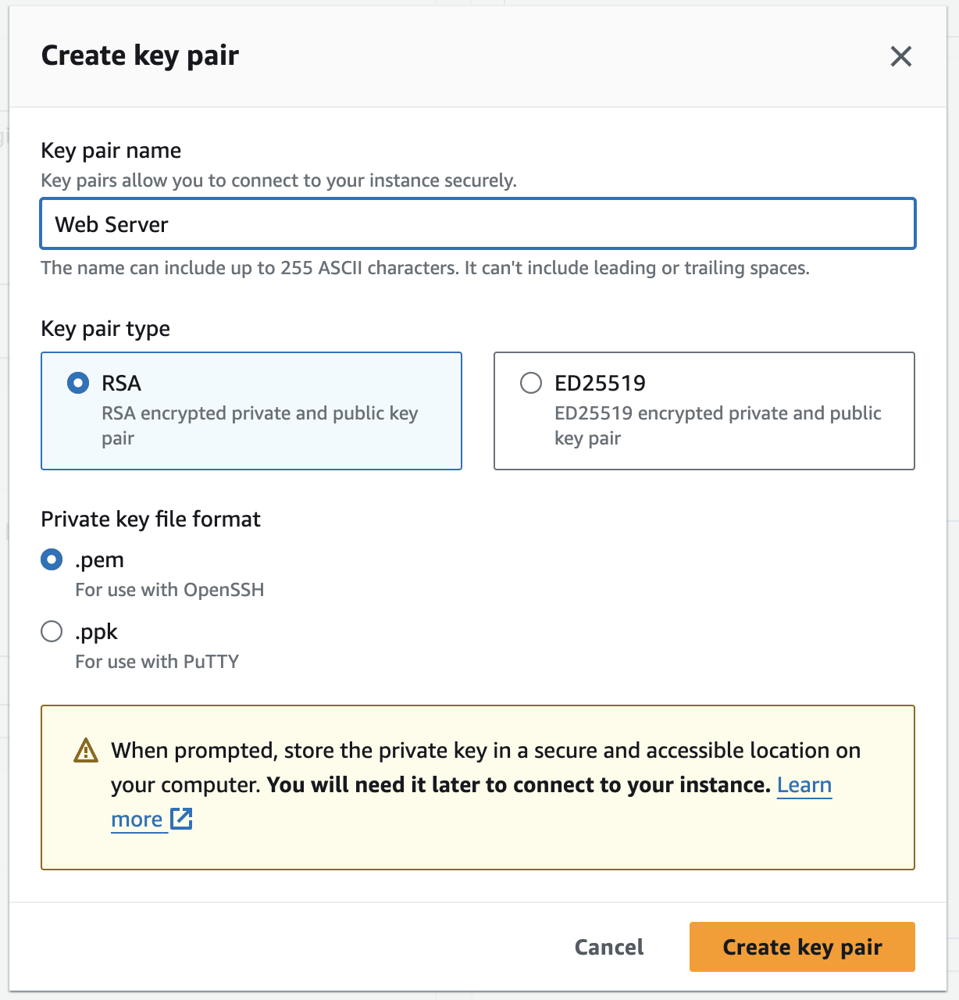
   5. Under Network Settings, use the default settings.
      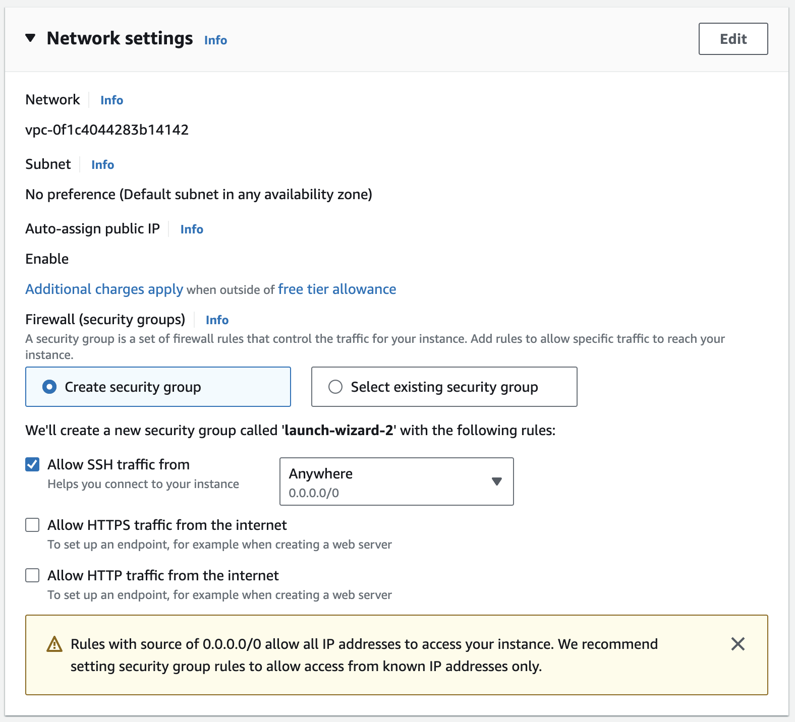
   6. Under Configure Storage, use the default settings.
      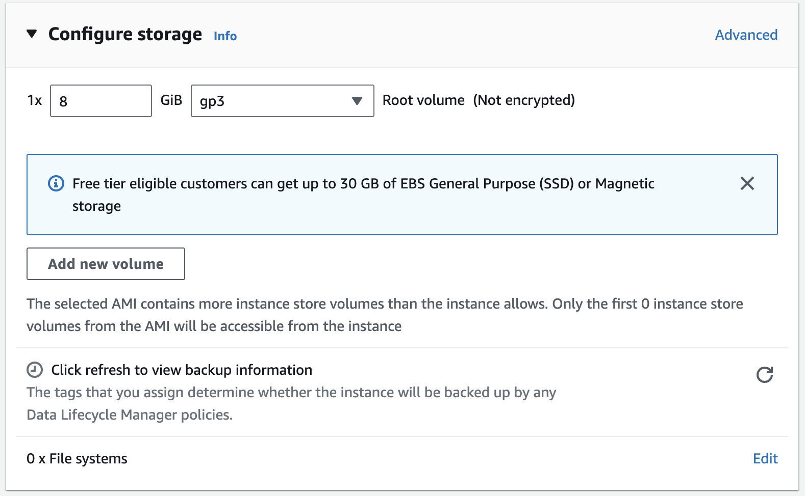
   7. Click Launch Instance to the right.
4. Click on the link to return to the instances screen and wait a few moments while your server boots.
5. Once your server has an ip address, attempt to connect to it with: `ssh -i "<Login Key>.pem" ubuntu@<ip address>` (ex: `ssh -i "Web Server.pem" ubuntu@3.88.107.55`). Note: you may receive a warning on your first server connection, asking if you trust the key, type `yes` then hit enter. If you receive a permissions warning strengthen the permissions with `chmod 0600 "<Login Key>.pem"`.
   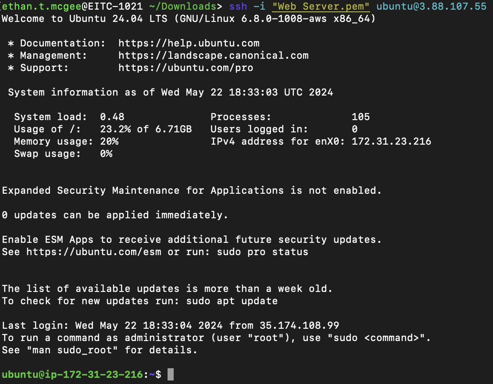
6. Once logged into the server, run security updates: `sudo apt-get update && sudo apt-get upgrade -y`
   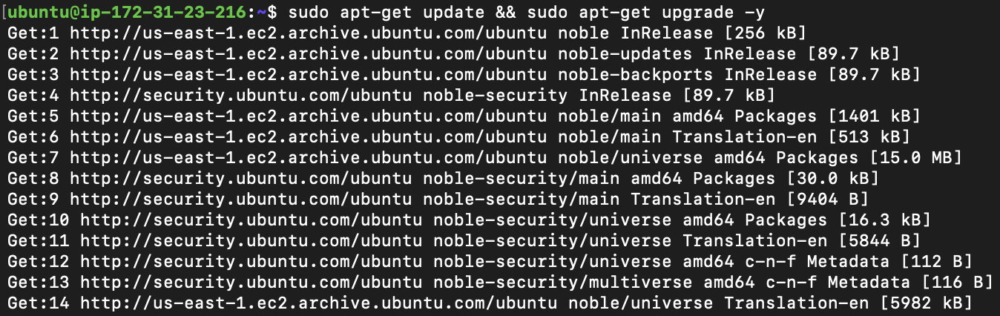
7. Now install python: `sudo apt-get install -y python3-pip`
   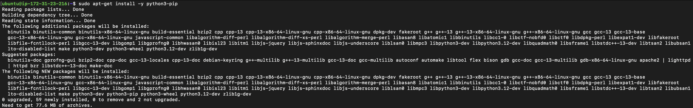
8. Type `exit` to leave the server and return to your machine.

### Application Setup

Congratulations! You have a server running in the cloud, but it has nothing on it. Let's fix that.

1. Login to your server again: `ssh -i "<Login Key>.pem" ubuntu@<ip address>`.
2. Create a directory to house your web application `mkdir flask-app`.
   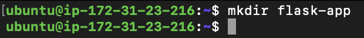
3. Exit the server.
4. Download this repository, extract the zip, then `cd` into the extracted folder.
5. Let's copy the `flask_app.py` file to the folder you just made on the server. `scp -i "<Login Key>.pem" flask_app.py ubuntu@<ip address>:~/flask-app/`
   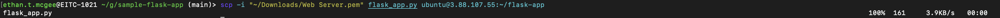
6. Do the same with the `requirements.txt`: `scp -i "<Login Key>.pem" requirements.txt ubuntu@<ip address>:~/flask-app/`
   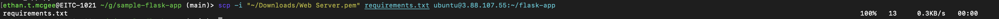

> Note: As you move forward with your project, any changes you make to either file on your local machine will need to be copied to the server with the same commands. Ditto goes for any new files.

7. Finally, copy the `flask-app.service` files: `scp -i "<Login Key>.pem" flask-app.service ubuntu@<ip address>:~/`
   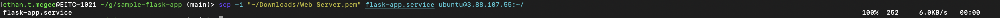
8. Log back into the server, then `cd flask-app`. Run `ls` to see that the `flask_app.py` and `requirements.txt` were copied successfully. If you don't see the files, stop here and reattempt the above or seek help until they are present.
   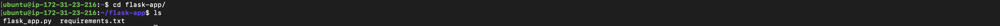
9. Let's setup flask and try the server.

```
sudo pip3 install --break-system-packages -r requirements.txt
python3 flask_app.py
```

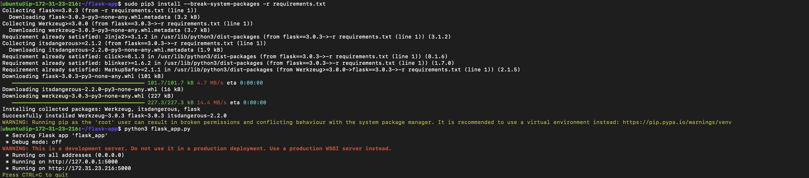

You should see a message that the app is running.

10. Stop the app with `<crtl> + c` then `cd ..`. Run `ls` to see the service file you copied earlier. If you don't see the file, stop here and reattempt the above or seek help until it is present.
    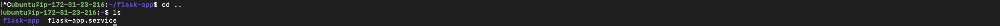
11. Let's install the service.

```
sudo cp flask-app.service /etc/systemd/system/
sudo systemctl daemon-reload
sudo systemctl enable flask-app
sudo service flask-app start
```

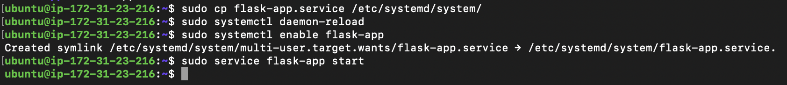

12. Now if you run `sudo service flask-app status` you should be able to see the service running.
    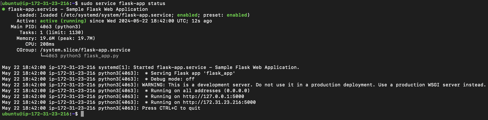
13. NIf you need to change the service you can stop it with `sudo service flask-app stop` or restart it with `sudo service flask-app restart`.

### Network

All right, our service is running but isn't accessible at all to users, which means its kinda pointless, let's fix that.

1. In the AWS Console, using the search bar, search for `Security Groups`.
2. There should be two security groups, a `default` and a `launch wizard`. We are not going to touch the `default` group.
3. Name the `launch wizard` group to `web-server-tg`.
   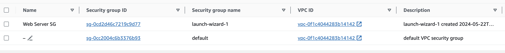
4. Make another security group named `load-balancer-sg`.
5. Under Inbound Rules, add two rules.
   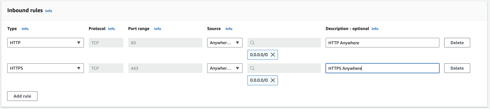
6. Copy the security group id of your new group.
   
7. Edit the inbound rules of your `launch wizard` group. Add a new rule.
   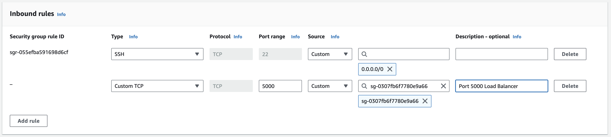
8. In AWS Console, using the search bar, search for Target Groups.
9. Create a new target group.
   1. Leave the type as Instances.
      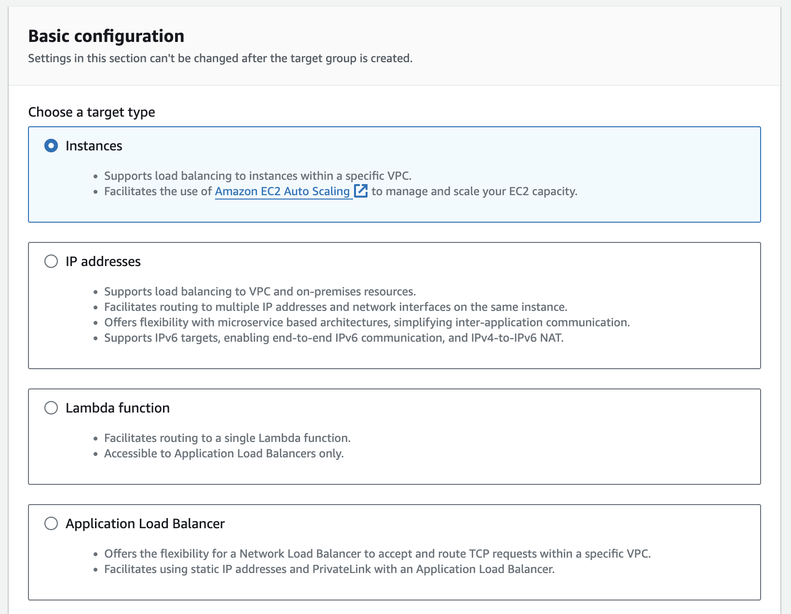
   2. Name the group Web Server TG but update the port to 5000.
      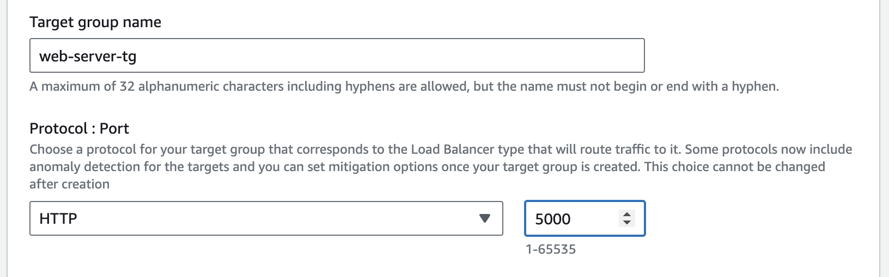
   3. Leave the IP settings as their default.
      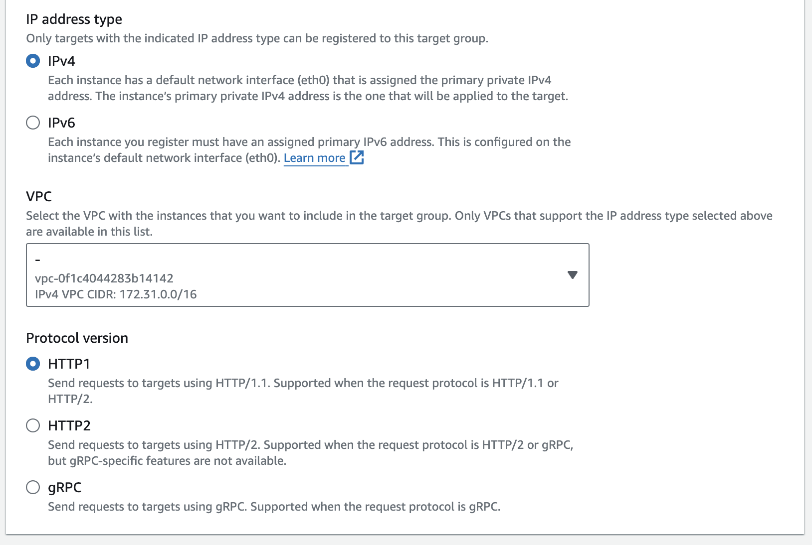
   4. Leave all other settings, then click Next.
      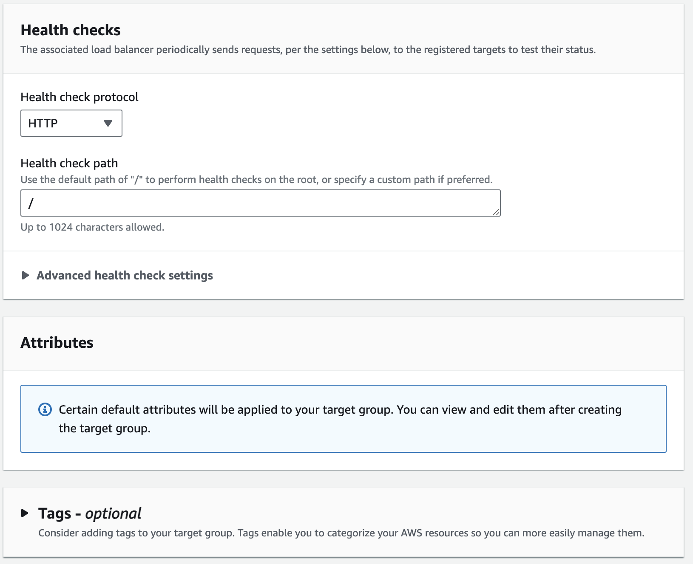
   5. Under available instances, check the box beside your instance, then click Include as pending below.
      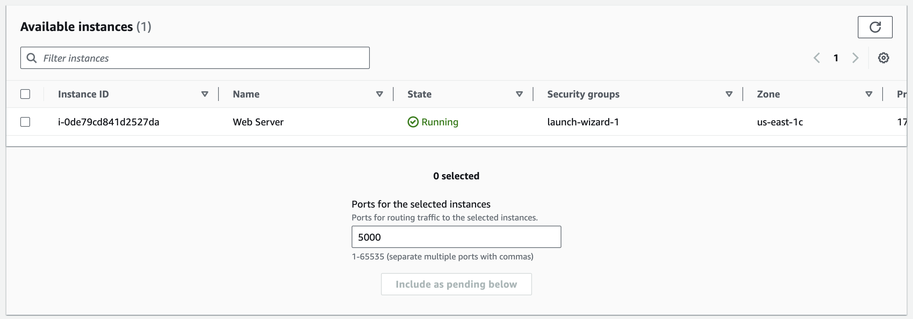
   6. Click Create Target Group.
10. In AWS Console, using the search bar, search for Load Balancers (the ec2 one).
11. Create a new load balancer.
    1. Pick Application Load Balancer for the type.
    2. Name the load balancer `web-server-lb`.
       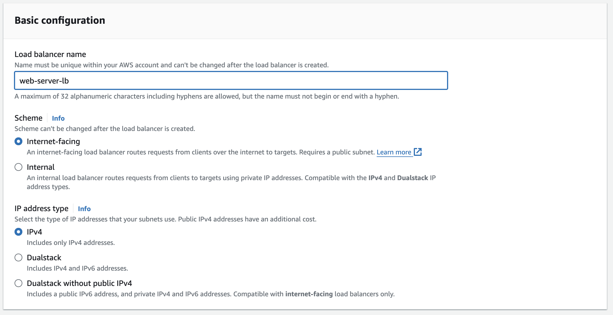
    3. Check all the boxes under Network Mapping.
       
    4. Under security groups, remove default, and select your `load-balancer-sg` group.
       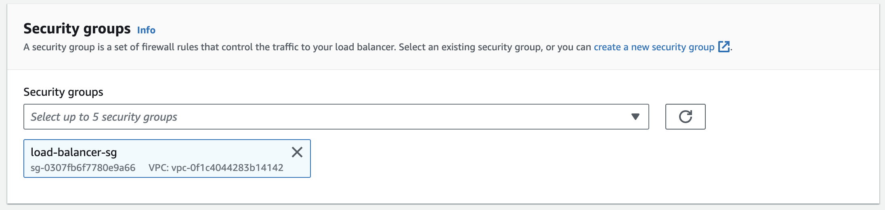
    5. Under Listenders and Routing, change the target group to `web-server-tg`.
       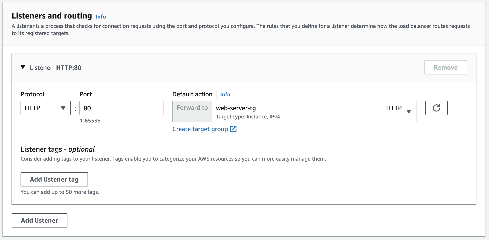
    6. Click create load balancer.
12. On the next screen, wait until your load balancer is provisioned, then copy / paste the DNS name into a browser. Your website should appear (Note: You may have to wait until 2 hours).

### DNS

The website works! And other folks can access it, but that domain name isn't very nice. Let's get a nicer domain name and set it up.

> Note: I assume at this point you have created [Namecheap](https://namecheap.com) and [Cloudflare](https://cloudflare.com) accounts. I also assume you have acquired a domain name either through Namecheap's Github Education Pack deal, or by purchasing one yourself. The domain I will use as an example is `https://ethantmcgee.me`

1. Login to your Namecheap Dashboard, then go to Domains and click Manage beside the domain we are setting up.
   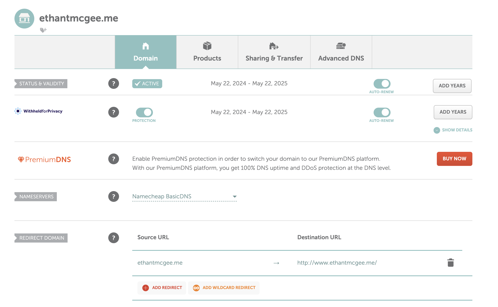
2. In another tab, login to your Cloudflare dashboard, then click Add Site.
   1. Type in your Domain then click Continue.
      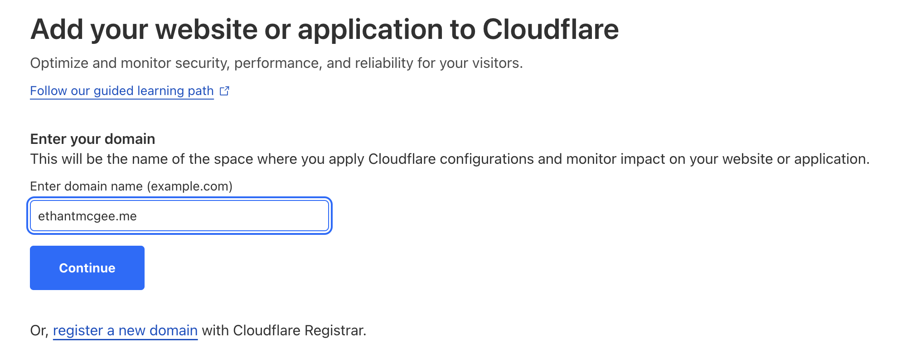
   2. Scroll down and click Free then Continue.
      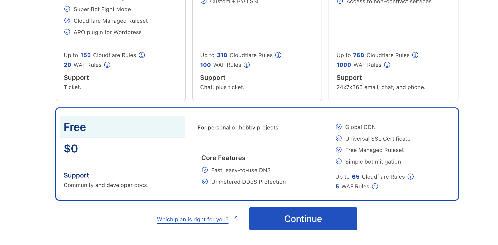
   3. On the next screen, if there are any records present, delete them.
   4. Click Continue, ignoring the warning.
      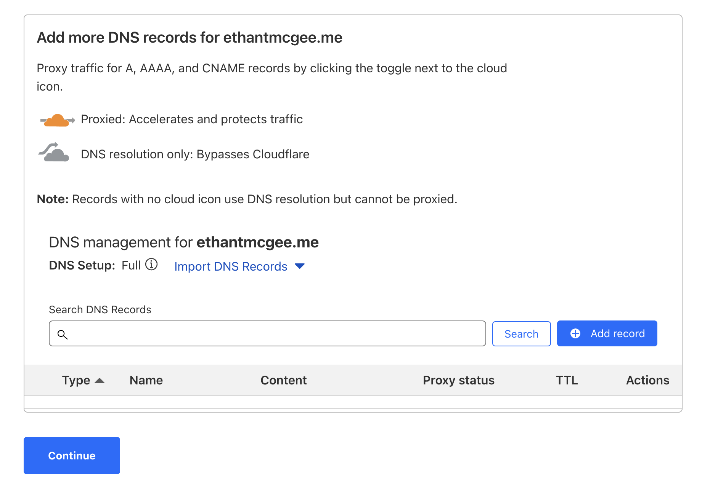
   5. This page will give you two nameservers (i.e. `ben.ns.cloudflare.com` and `mia.ns.cloudflare.com`). Copy them.
      
3. Back on Namecheap. Find the Nameservers section, change to Custom DNS, and paste in the two nameservers Cloudflare provided, then click the green check.
   
4. Close the Namecheap tab.
5. Back on Cloudflare.
   1. Click Continue.
      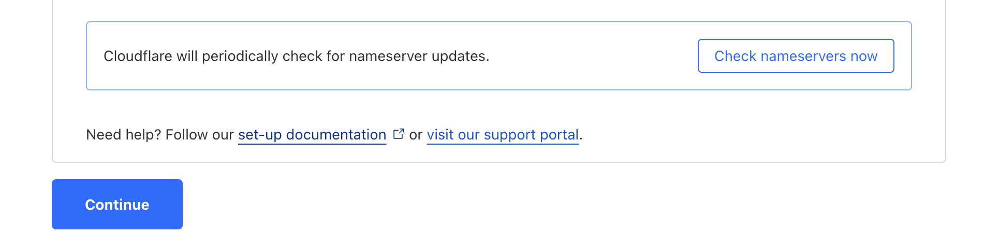
   2. On the next screen, enable automatic HTTPS Rewrites, enable Always Use HTTPS, disable brotli (if you are not offered this option, ignore as this is a setting Cloudflare plans to soon deprecate.)
   3. Click Finish.
   4. Click the DNS button in the corner.
      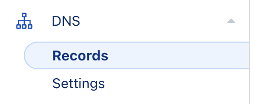
   5. Click Add Record.
   6. For the type use CNAME, for the Name use `@` and for the value, use AWS's Domain Name for the load balancer.
      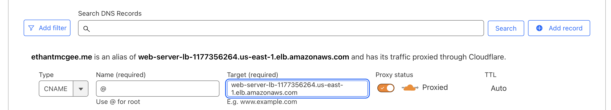
   7. Click Save.
   8. Repeat this process, but change the name to `www`.
      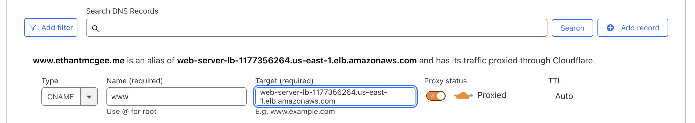
   9. Click Save.
   10. Wait 1-2 hours, then visit your domain (i.e. `https://ethantmcgee.me`) in a browser. It should work.
